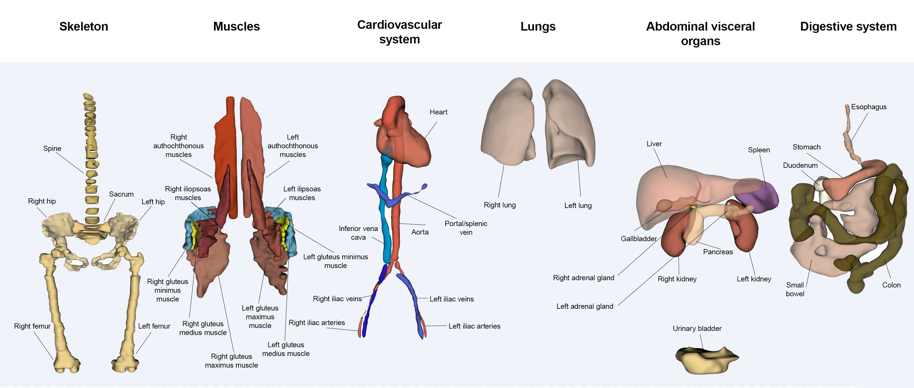

<h2 align="center"> MRSegmentator: Multi-Modality Segmentation of 40 Classes in MRI and CT </h2> 

***

<div align="center">
<a href="https://github.com/hhaentze/MRSegmentator/actions"></a>
<a href="https://github.com/hhaentze/MRSegmentator/blob/master/License.txt"></a>  
<a href="https://pypi.org/project/mrsegmentator/"></a>  
<a href="https://github.com/psf/black"></a>
</div>

> Detect and segment 40 classes in MRI scans of the abdominal / pelvic / thorax region


Contrary to CT scans, where tools for automatic multi-structure segmentation are quite mature, segmentation tasks in MRI scans are often either focused on the brain region or on a subset of few organs in other body regions. MRSegmentator aims to extend this and accurately segment 40 organs and structures in human MRI scans of the abdominal, pelvic and thorax regions. The segmentation works well on different sequence types, including T1- and T2-weighted, Dixon sequences and even CT images. Read more about it in our preprint: https://arxiv.org/pdf/2405.06463.

Check out some sample segmentations on our [Hugging Face Space](https://huggingface.co/spaces/kbressem/MRSegmentator)! 🤗

Understand the model in depth by reading our [Evaluation](evaluation) section. 
 


## Docker Image
You can run an MRSegmentator Docker image directly from [MHub](https://mhub.ai/models/mrsegmentator).
```bash
$input_dir=/path/to/input
$output_dir=/path/to/output

docker run --rm -t --gpus all --network=none -v $input_dir:/app/data/input_data:ro -v $output_dir:/app/data/output_data mhubai/mrsegmentator:latest --workflow default
```

## Installation
Install MRSegmentator with pip:
```bash
# Create virtual environment
conda create -n mrseg python=3.11 pip
conda activate mrseg

# Optionally: install pytorch. 
# conda install pytorch==2.3.1 torchvision==0.18.1 torchaudio==2.3.1 pytorch-cuda=12.1 -c pytorch -c nvidia

# Install MRSegmentator
python -m pip install mrsegmentator
```
If the installed pytorch version is not compatible to your system, you might need to install it manually. One common error message is "A module that was compiled using NumPy 1.x cannot be run in
NumPy 2.2.2 as it may crash." Please refer to [PyTorch](https://pytorch.org/get-started/locally/). MRSegmentator requires torch <= 2.3.1.

## Inference
MRSegmentator segments all .nii and .nii.gz files in an input directory and writes segmentations to the specified output directory. To speed up segmentation you can increase the `--batchsize` or select a single model for inference with `--fold 0`.
MRSegmentator requires a lot of memory and can run into OutOfMemory exceptions when used on very large images. You can reduce memory usage by setting ```--split_level``` to 1 or 2. Be aware that this increases runtime. Read more about the options in the [Evaluation](evaluation) section. 

```bash
mrsegmentator --input <nifti file or directory>
```

Options:
```bash
-i, --input <str> [required] # input directory or file

--outdir <str>  # output directory
--fold <int> # use only a single model for inference 
--postfix <str> # postfix that will be added to segmentations, default: "seg"
--cpu_only # don't use a gpu

# memory (mutually exclusive)
--batchsize <int> # number of images that can be loaded to memory at the same time, default: 8 
--split_level <int> # split images to reduce memory usage. Images are split recursively: A split level of x will produce 2^x smaller images

# experimental
--split_margin <int> # split images with an overlap of 2xmargin to avoid hard cutt-offs between segmentations of top and bottom image, default: 3
--nproc <int> # number of processes
--nproc_export <int> # number of processes for exporting the segmentations
--verbose
```

## Python API
```python
from mrsegmentator import inference
import os

outdir = "outputdir"
images = [f.path for f in os.scandir("image_dir")]

inference.infer(images, outdir)
```

## Change Path to Weights
MRSegmentator will automatically download its weights and save them in `.conda/envs/<name>/lib/python3.11/site-packages/mrsegmentator/weights`.
This enables easy uninstallation including the weights, should you decide to clean your virtual environments.

Alternatively you can save the weights in a set location on your machine. This helps a lot if you have multiple environments. For this you need to:
1. Download them from [releases](https://github.com/hhaentze/MRSegmentator/releases/tag/v1.2.0) or move them from your conda environment
2. Unzip the files
3. Set the variable "MRSEG_WEIGHTS_PATH" to your weights directory
(e.g.; `export MRSEG_WEIGHTS_PATH="/home/user/weights`)


## How To Cite
If you use our work in your research, please cite our preprint on arXiv: https://arxiv.org/pdf/2405.06463.

## Class details



|Index|Class|
| :-------- | :------- |
| 0 | background |
| 1 | spleen |
| 2 | right_kidney |
| 3 | left_kidney |
| 4 | gallbladder |
| 5 | liver |
| 6 | stomach |
| 7 | pancreas |
| 8 | right_adrenal_gland |
| 9 | left_adrenal_gland |
| 10 | left_lung |
| 11 | right_lung |
| 12 | heart |
| 13 | aorta |
| 14 | inferior_vena_cava |
| 15 | portal_vein_and_splenic_vein |
| 16 | left_iliac_artery |
| 17 | right_iliac_artery |
| 18 | left_iliac_vena |
| 19 | right_iliac_vena |
| 20 | esophagus |
| 21 | small_bowel |
| 22 | duodenum |
| 23 | colon |
| 24 | urinary_bladder |
| 25 | spine |
| 26 | sacrum |
| 27 | left_hip |
| 28 | right_hip |
| 29 | left_femur |
| 30 | right_femur |
| 31 | left_autochthonous_muscle |
| 32 | right_autochthonous_muscle |
| 33 | left_iliopsoas_muscle |
| 34 | right_iliopsoas_muscle |
| 35 | left_gluteus_maximus |
| 36 | right_gluteus_maximus |
| 37 | left_gluteus_medius |
| 38 | right_gluteus_medius |
| 39 | left_gluteus_minimus |
| 40 | right_gluteus_minimus |

##  Acknowledgements
This work was in large parts funded by the Wilhelm Sander Foundation.
Funded by the European Union. Views and opinions expressed are however those of the author(s) only and do not necessarily reflect those of the European Union or European Health and Digital Executive Agency (HADEA). Neither the European Union nor the granting authority can be held responsible for them.

