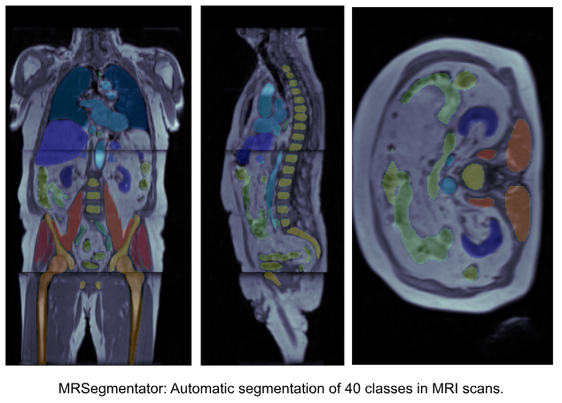

# MRSegmentator: Robust Multi-Modality Segmentation of 40 Classes in MRI and CT Sequences 
> Detect and segment 40 classes in MRI scans of the abdominal / pelvic / chest region

Contrary to CT scans, where tools for automatic multi-structure segmentation are quite mature, segmentation tasks in MRI scans are often either focused on the brain region or on a subset of few organs in other body regions. MRSegmentator aims to extend this and accurately segment 40 organs and structures in human MRI scans of the abdominal, pelvic and chest regions. The segmentation works well on different sequence types, including T1- and T2-weighted, Dixon sequences and even CT images.



## Installation
1. Install [PyTorch](https://pytorch.org/get-started/locally/) based on your system requirements
2. Install MRSegmentator with pip 
3. Download the weights and extract them into your model directory

Example workflow:
```bash
# Create virtual environment
conda create -n mrseg python=3.11 pip
conda activate mrseg

# Install pytorch
conda  install pytorch==2.0.1 torchvision==0.15.2 torchaudio==2.0.2 pytorch-cuda=11.7 -c pytorch -c nvidia

# Install MRSegmentator
python -m pip install -i https://test.pypi.org/simple/ --extra-index-url https://pypi.org/simple mrsegmentator

# Inference
mrsegmentator  \
--modeldir "/sc-projects/sc-proj-cc06-ag-ki-radiologie/Niere/ukbb/ckpts/mr_segmentator_weights/" \
--input <nifti file or directory> \
--outdir <directory> \
--force_LPS \
--fold 0 

# Download Weights (TODO) (Currently the weights are stored on the cluster)
# wget https://www.url-placeholder.de/weights.zip
# unzip weights.zip
```

## Inference
MRSegmentator segments all .nii and .nii.gz files in an input directory and writes segmentations to the specified output directory. Nifti files must be in the LPS orientation. If thats not the case for your data add the flag ```--force_LPS``` and MRSegmentator automaticaly changes image orientation before the inference step. Afterwards, the segmenation's orientation will be changed back to match the original image.

```bash
mrsegmentator --modeldir <model directory> \
    --input <input directory or file> \
    --outdir <output directory> 
```

Options:
```bash
--modeldir <str> [required]  # model directory
--input <str> [required] # input directory or file
--outdir <str> [required] # output directory

--fold <int> # use only a single model for inference 
--crossval # Run all 5 models individually. Useful to analyse differences between the models.

--is_LPS # if your images are in LPS orientation you can set this flag to skip one preprocessing step. This decreases runtime
--postfix <str> # postfix that will be added to segmentations. Default: "seg"
--cpu_only # don't use a gpu
--verbose
```

<!-- |option|required|description|
| :-------- | :-------: |  :------- |
--modeldir \<str> | [required] | model directory | 
--indir <str>  | [required] | input directory | 
--outdir <str>  | [required] | output directory | 
--fold <int> |  |  Only use a single model for segmentations. This accelerates the prediction for the sake of accuracy. | 
--crossval  |  | Run all 5 models individually. Useful to analyse differences between the models. | 
--force_LPS  |  | change image orientation to LPS. The orientation of segmentations will be changed back to its original configuration after the inference step (increases RAM usage) | 
--cpu_only  |  | don't use a gpu |  -->

## Class details

|Index|Class|
| :-------- | :------- |
| 0 | background |
| 1 | spleen |
| 2 | right_kidney |
| 3 | left_kidney |
| 4 | gallbladder |
| 5 | liver |
| 6 | stomach |
| 7 | pancreas |
| 8 | right_adrenal_gland |
| 9 | left_adrenal_gland |
| 10 | left_lung |
| 11 | right_lung |
| 12 | heart |
| 13 | aorta |
| 14 | inferior_vena_cava |
| 15 | portal_vein_and_splenic_vein |
| 16 | left_iliac_artery |
| 17 | right_iliac_artery |
| 18 | left_iliac_vena |
| 19 | right_iliac_vena |
| 20 | esophagus |
| 21 | small_bowel |
| 22 | duodenum |
| 23 | colon |
| 24 | urinary_bladder |
| 25 | spine |
| 26 | sacrum |
| 27 | left_hip |
| 28 | right_hip |
| 29 | left_femur |
| 30 | right_femur |
| 31 | left_autochthonous_muscle |
| 32 | right_autochthonous_muscle |
| 33 | left_iliopsoas_muscle |
| 34 | right_iliopsoas_muscle |
| 35 | left_gluteus_maximus |
| 36 | right_gluteus_maximus |
| 37 | left_gluteus_medius |
| 38 | right_gluteus_medius |
| 39 | left_gluteus_minimus |
| 40 | right_gluteus_minimus |