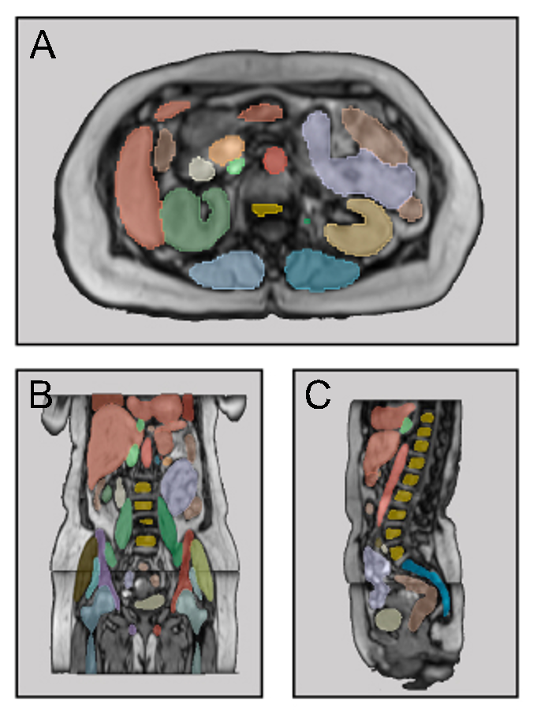
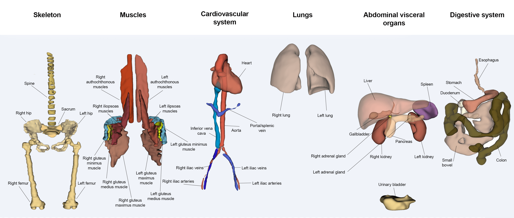

<h2 align="center"> MRSegmentator: Multi-Modality Segmentation of 40+10 Classes in MRI and CT </h2> 

***

<div align="center">
<a href="https://github.com/hhaentze/MRSegmentator/actions"></a>
<a href="https://github.com/hhaentze/MRSegmentator/blob/master/License.txt"></a>  
<a href="https://pypi.org/project/mrsegmentator/"></a>  
<a href="https://github.com/astral-sh/ruff"></a>
</div>

> Detect and segment 40 classes in MRI and CT of the abdominal / pelvic / thorax region.
> Now with 10 additional body composition classes in MRI


Contrary to CT scans, where tools for automatic multi-structure segmentation are quite mature, segmentation tasks in MRI scans are often either focused on the brain region or on a subset of few organs in other body regions. MRSegmentator aims to extend this and accurately segment 40 organs and structures in human MRI scans of the abdominal, pelvic and thorax regions. The segmentation works well on different sequence types, including T1- and T2-weighted, Dixon sequences and even CT images. 


### Updates (v2.0.0)
- We added 10 additional body composition classes, exclusively for MRI. You can segment them by setting `--body_comp`
- You can accelerate segmentation with the `--fast` flag
 



## Installation
Install MRSegmentator with pip:
```bash
# Create virtual environment
conda create -n mrseg python=3.11 pip
conda activate mrseg

# Install MRSegmentator
python -m pip install mrsegmentator
```
If the installed pytorch version is not compatible to your system, you might need to install it manually. Please refer to [PyTorch](https://pytorch.org/get-started/locally/). MRSegmentator requires torch <= 2.3.1.

## Docker Image
You can run an MRSegmentator (v1.2) Docker image directly from [MHub](https://mhub.ai/models/mrsegmentator).
```bash
$input_dir=/path/to/input
$output_dir=/path/to/output

docker run --rm -t --gpus all --network=none -v $input_dir:/app/data/input_data:ro -v $output_dir:/app/data/output_data mhubai/mrsegmentator:latest --workflow default
```


## Inference
MRSegmentator segments all `.nii/.nii.gz/.mha/.nrrd` files in an input directory and writes segmentations to the specified output directory. To speed up segmentation you can increase the `--batchsize` or select a single model for inference with `--fast`.
MRSegmentator requires a lot of memory and can run into OutOfMemory exceptions when used on very large images. You can reduce memory usage by setting ```--split_level``` to 1 or 2. Be aware that this increases runtime. Read more about the options in the [Evaluation](evaluation) section. 

You can now also run MRSegmentator on DICOM directories, in which case it produces a  DICOM SEG. (Make sure that there is only a single series UID in the directory). You can also convert previously created segmentations back to DICOM SEG (see [dcm_helper](DCM_Helper_README.md)).

```bash
mrsegmentator --input <file / directory / DICOM directory>
```

Options:
```bash
-i, --input <str> [required] # input directory or file

-o --outdir <str>   # output directory
--fast              # accelerate segmentation by disabling ensembling, mirroring, and by using a larget step size
--postfix <str>     # postfix that will be added to segmentations, default: "seg"
--cpu_only          # don't use a gpu

# memory (mutually exclusive)
--batchsize <int>   # number of images that can be loaded to memory at the same time, default: 8 
--split_level <int> # split images to reduce memory usage. Images are split recursively: A split level of x will produce 2^x smaller images

# debugging
--log_level <["DEBUG", "INFO", "WARNING", "ERROR"]> # Default: INFO
--no_tqdm               # disable tqdm progress bars

# experimental
--split_margin <int>    # split images with an overlap of 2xmargin to avoid hard cutt-offs between segmentations of top and bottom image, default: 3
--nproc <int>           # number of processes
--nproc_export <int>    # number of processes for exporting the segmentations
--fold <int>            # specify a single fold for segmentation
```

## Python API
```python
from mrsegmentator import inference
import os

outdir = "outputdir"
images = [f.path for f in os.scandir("image_dir")]

inference.infer(images, outdir, model_name="base")
```

## Manage Weights
Weights are automatically downloaded to `~/.mrsegmentator`. If you want to specify a custom weights directory you can do so by setting an environmental variable: `export MRSEG_WEIGHTS_PATH=<path>`.

You can also use MRSegmentator as an interface to run other nnunetv2 models by pointing the MRSEG_WEIGHTS_PATH variable directly to the nnunetv2 folder with the plans.json file. By doing so you have a nice inference interface with all the included pre-processing:

 - force LPS orientation during loading
 - support for various file types
 - fast mode (--fast) and memory efficiency (--split_level 2)

## How To Cite
If you use our work in your research, please cite our article: https://doi.org/10.1148/ryai.240777.

If you use the body composition classes, please additionally cite this preprint: https://doi.org/10.1101/2025.06.03.25328867

## Class details



|Index|Class|
| :-------- | :------- |
| 0 | background |
| 1 | spleen |
| 2 | right_kidney |
| 3 | left_kidney |
| 4 | gallbladder |
| 5 | liver |
| 6 | stomach |
| 7 | pancreas |
| 8 | right_adrenal_gland |
| 9 | left_adrenal_gland |
| 10 | left_lung |
| 11 | right_lung |
| 12 | heart |
| 13 | aorta |
| 14 | inferior_vena_cava |
| 15 | portal_vein_and_splenic_vein |
| 16 | left_iliac_artery |
| 17 | right_iliac_artery |
| 18 | left_iliac_vena |
| 19 | right_iliac_vena |
| 20 | esophagus |
| 21 | small_bowel |
| 22 | duodenum |
| 23 | colon |
| 24 | urinary_bladder |
| 25 | spine |
| 26 | sacrum |
| 27 | left_hip |
| 28 | right_hip |
| 29 | left_femur |
| 30 | right_femur |
| 31 | left_autochthonous_muscle |
| 32 | right_autochthonous_muscle |
| 33 | left_iliopsoas_muscle |
| 34 | right_iliopsoas_muscle |
| 35 | left_gluteus_maximus |
| 36 | right_gluteus_maximus |
| 37 | left_gluteus_medius |
| 38 | right_gluteus_medius |
| 39 | left_gluteus_minimus |
| 40 | right_gluteus_minimus |

### Body Composition (Exclusively MRI)

| Index | Class |
| :--- | :--- |
| 1 | subcutaneous_fat |
| 2 | visceral_fat |
| 3 | left_rectus_abdominis |
| 4 | right_rectus_abdominis |
| 5 | left_oblique_muscle |
| 6 | right_oblique_muscle |
| 7 | left_quadratus_lumborum |
| 8 | right_quadratus_lumborum |
| 9 | abdominal_subcutaneous_fat |
| 10 | gluteofemoral_fat |


## Testing
The test suite has two modes:

**Smoke tests** — no model weights or real images required, runs in seconds

**Integration tests** — requires model weights and at least one real MRI/CT image

```bash
make smoke

cp tests/mrsegmentator/integration_config.example.py tests/mrsegmentator/integration_config.py
#fill in MODEL_PATH and TEST_IMAGES
make full
```

Integration tests run inference exactly once and validate that outputs have correct labels, geometry, and are readable. 
Slice figures (axial / coronal / sagittal) are saved to `reports/figures/` after each run.


##  Acknowledgements
This work was in large parts funded by the Wilhelm Sander Foundation.
Funded by the European Union. Views and opinions expressed are however those of the author(s) only and do not necessarily reflect those of the European Union or European Health and Digital Executive Agency (HADEA). Neither the European Union nor the granting authority can be held responsible for them.

